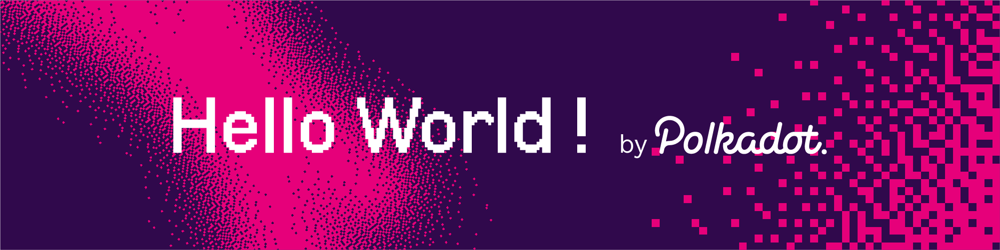

---

# Hello World! By Polkadot hackathon submissions

- [[ECOSYSTEM CHALLENGE] Using Remix And MetaMask On Moonbeam](https://gitcoin.co/issue/PureStake/gitcoin-hello-world-by-moonbeam/3/100023962)

  - [using-remix-and-metamask-on-moonbeam.md](using-remix-and-metamask-on-moonbeam.md)

- [[ECOSYSTEM CHALLENGE] Deploy On Moonbase Alpha Using Truffle](https://gitcoin.co/issue/PureStake/gitcoin-hello-world-by-moonbeam/1/100023953)

  - [deploy-on-moonbase-alpha-using-truffle.md](deploy-on-moonbase-alpha-using-truffle.md)

- [[BEGINNER CHALLENGE] Launch A Local Substrate Development Chain](https://gitcoin.co/issue/Polkadot-Network/hello-world-by-polkadot/17/100023943)

  - [launch-a-local-substrate-development-chain.md](launch-a-local-substrate-development-chain.md)

- [[BEGINNER CHALLENGE] Run A Private Substrate Network](https://gitcoin.co/issue/Polkadot-Network/hello-world-by-polkadot/16/100023942)

  - [launch-a-private-substrate-network.md](launch-a-private-substrate-network.md)
